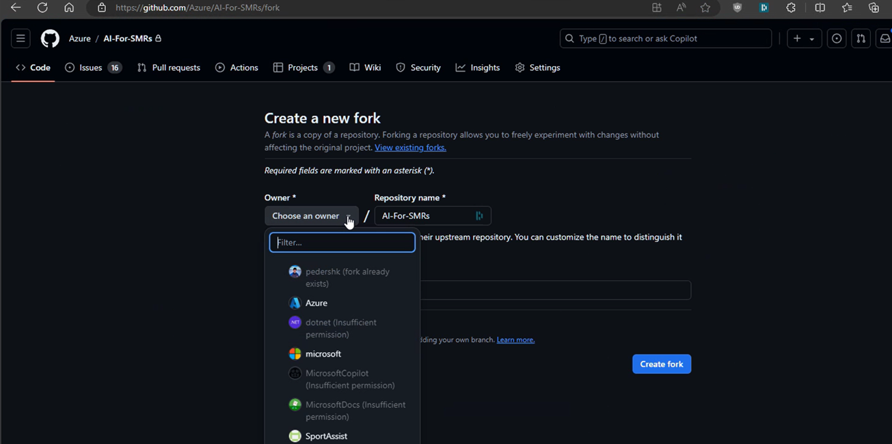
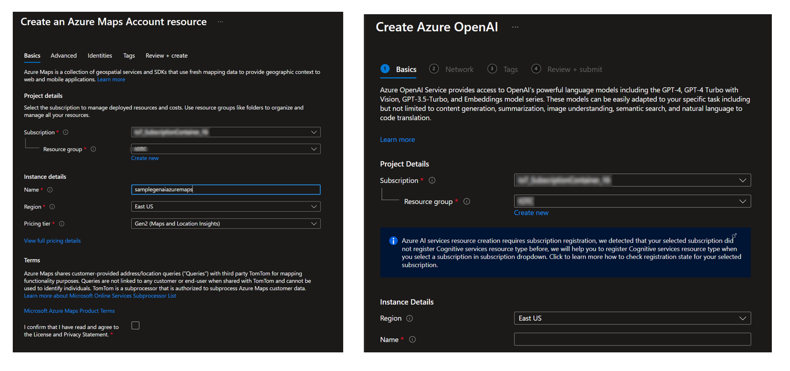
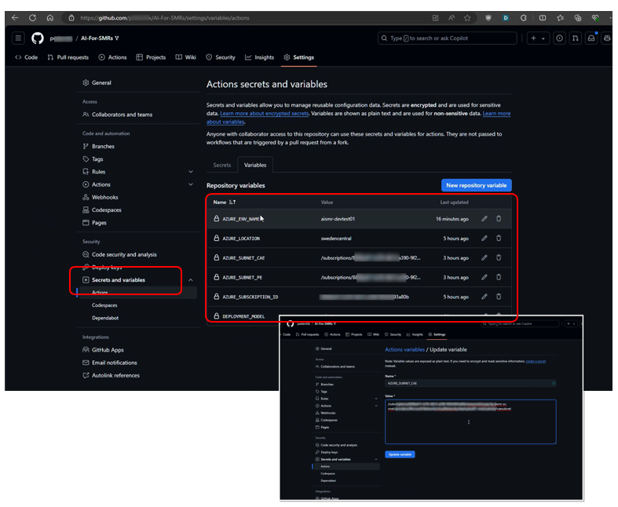

# Solution Deployment

## Important Update Notes

05/19/25:

- This update introduces configurable long-term memory backend options for storing vector embeddings.
  - You can now choose between Azure AI Search or Azure Postgres Flexible Server via the `MEMORY_BACKEND` GitHub Action variable.
  - Set `MEMORY_BACKEND` to `aisearch` (default) for Azure AI Search or `postgres` for Azure PostgreSQL Flexible Server.
  - For private deployments with Postgres backend, a pre-existing private DNS zone is required:
    - You must create a private DNS zone named "privatelink.postgres.database.azure.com"
    - Set the `POSTGRES_DNSZONE_RESOURCEID` GitHub Action variable to the resource ID of this DNS zone (format: `/subscriptions/{subscriptionId}/resourceGroups/{resourceGroupName}/providers/Microsoft.Network/privateDnsZones/privatelink.postgres.database.azure.com`)
    - The deployment will fail if this variable is not provided when required (for private deployments using PostgreSQL)

05/08/25:

- This update includes an optional move to Azure PostgreSQL Flexible Server for vector db storage.
  It requires a new private dns zone if you're running in private mode:

  - Azure PostgreSQL Flexible Server: "privatelink.postgres.database.azure.com"

  A new private endpoint is also created if you deploy in private mode. After deployment, you need to link this private endpoint
  to the private dns zone created above.

  The endpoint name is:

  - "$kmvectordb`<deploymentid>`-pl

04/14/25:

- This update includes three additional services - Azure Event Hubs, a new Storage account and a table storage account on that new storage account. If you deploy in _private_ mode, you will need to set the private dns zone for these three new private endpoints after deployment. Please make sure you have these private DNS zones created and available in your environment on an accessible subscription. They are as follows (replace with Azure US Government zone names if applicable):

  - Azure Event Hubs: "privatelink.servicebus.windows.net" (you should already have this if you have an earlier deployment)
  - Storage Account: "privatelink.blob.core.windows.net" (you should already have this if you have an earlier deployment)
  - Table Storage Account: "privatelink.table.core.windows.net"

  The endpoint names are as follows:

  - "orleans`<deploymentid>`-blob-pl"
  - "orleans`<deploymentid>`-table-pl"
  - "eventhub`<deploymentid>`-pl"

- It is now possible to disable reliance on the Azure SignalR service. If you want to do this and instead use the API as your SignalR endpoint, create a variable called "ENABLE_AZURE_SIGNALR" and set it the value to false - without quotes.

## Pre-Requisites

1. Fork the Repository, then download the fork you've created of the GenAI for Industry Permitting repository with git, and run this command from a PowerShell prompt (if you're on Windows, open Powershell through Terminal or the Windows Powershell application, if you're on Linux/Mac, precede the follow script name with "pwsh"). Make sure your active working directory is wherever you downloaded the repository to. This script creates the Service Principle used by the applicaion for it's ongoing operation. It acts as the Application client against Microsoft Entra to run authentication. Take note of the outputted secret details at the end of the script, this will be required for the PVICO_ENTRA_CREDENTIALS secret later on.

```powershell
.\build\scripts\sp-create.ps1
```

- 

2. Create a Service Principal for GitHub Actions to utilize for deployment. Either (1) Cloud Application Administrator or (2) Application Developer permission on the tenant (Microsoft Entra) is required to perform this step. Application Developer is normally sufficient - and both Cloud Application Administrator and Application Developer supersede it. To do this, run this command (you must have the Azure CLI installed and be logged on to the tenant using "az login" first - you can download the Azure CLI here if you don't have it : <https://learn.microsoft.com/en-us/cli/azure/install-azure-cli>). The output of this script should be noted for storage in the AZURE_CREDENTIALS secret in a later step. Substitute <subscriptionId> with your actual subscription id:

To create the service principal with owner permissions on the subscription(which allows the solution to create resource groups), run the following command:

```bash
  az ad sp create-for-rbac
          --name "sp-ms-industrypermitting-deploy"
          --scopes "/subscriptions/<subscriptionId>"
          --role owner
```

If you have a pre existing resource group you wish to use, you can create the service principal
with owner permissions on the resource group instead of the subscription. To do this, run the following command:

```bash
  az ad sp create-for-rbac
          --name "sp-ms-industrypermitting-deploy"
          --scopes "/subscriptions/<subscriptionId>/resourceGroups/<resourceGroupName>"
          --role owner
```

Please note that this requires the Resource Group to be created manually before running the deployment script.

If you wish to grant access to a an additional, different resource group for the already created service principal, you can run the following command, where <appId> is the application id of the service principal created above:

```bash
  az role assignment create
          --role "Owner"
          --assignee <appId>
          --scope /subscriptions/<subscriptionId>/resourceGroups/<resourceGroupName>

```

3. Create the following pre-req resources in Azure Portal. These can be in any Resource Group:

   1. Azure OpenAI service
      - Create a deployment for EITHER GPT-4o (highly recommended) or GPT-4 v 1106-preview.
        - For GPT-4o - it needs to be called "gpt-4o"
        - For GPT-4-128K/Turbo - it needs to be called "gpt-4-128k"
        - We recommend a 150,000 tokens per minute (TPM) limit as a minimum.
      - Create a deploymend for text-embedding-ada-002.
        - Call it "text-embedding-ada-002" and select v2 (should be the default).
        - We recommend a 300,000 tokens per minute (TPM) limit as a minimum
   2. Azure Maps

   - 

4. If using private networking:

   - Create or select a VNET in the Azure Portal in the same subscription of the deployment
   - Create or select a Subnet in the VNET created above (min /24)
   - Create a Subnet for Container Apps Environment for GenAI for Industry Permitting (min /23)
     - The Subnet for Container Apps Environment must use Subnet Delegation - delegate to Microsoft.App.Environments.
   - Create a Subnet for Azure PostgreSQL Flexible server (min /28)
     - The Subnet for Azure PostgreSQL Flexible server muse use subnet delegation - delegate to Microsoft.DBforPostgreSQL/flexibleServers
   - Take note of the Subnet ID for both of these subnets, you will these to fill in the the AZURE_SUBNET_CAE and AZURE_SUBNET_PE variables.
   - Create a Private DNS Zone named "privatelink.postgres.database.azure.com" (required for PostgreSQL backend in private deployments)
     - Take note of the resource ID of this DNS zone for the POSTGRES_DNSZONE_RESOURCEID variable

5. Add the following deployment variables to the Secrets and Variables section of the repository:

   - Secrets:
     - AZURE_CREDENTIALS : { The output of the creation command for the deployment service principal in Step 2 above }
     - PVICO_AZUREMAPS_KEY : { The Key to the Azure Maps instance you created in Step 3 }
     - PVICO_ENTRA_CREDENTIALS : { This is the output of the .\sp-create.ps1 script run above }
     - PVICO_OPENAI_CONNECTIONSTRING : { Use the following format : Endpoint=\<endpoint of Azure Openai Instance\>;Key=\<key of Azure OpenAI instance\> }
   - Variables:

     - AZURE_CLOUD: {AzureUSGovernment | AzureCloud}
     - AZURE_RESOURCE_GROUP: {Whatever you’d like the Resource Group to be named.}
     - AZURE_LOCATION : {usgovvirginia | swedencentral}
     - AZURE_SUBNET_CAE : {This is the Subnet ID of the Container Apps Environment subnet created above - find it in the portal}
     - AZURE_SUBNET_PE : {This is the Subnet ID of the services subnet created above - find it in the portal}
     - AZURE_SUBNET_POSTGRES : {This is the Subnet ID of the Azure Postgres subnet create above - find it in the portal}
     - AZURE_SUBSCRIPTION_ID: {Your Subscription ID}
     - DEPLOYMENT_MODEL: {private | public}
     - MEMORY_BACKEND: {aisearch | postgres} (Optional, defaults to 'aisearch')
     - POSTGRES_DNSZONE_RESOURCEID: {Required for private deployments with PostgreSQL backend. The resource ID of your pre-existing private DNS zone for PostgreSQL Flexible Server, in format `/subscriptions/{subscriptionId}/resourceGroups/{resourceGroupName}/providers/Microsoft.Network/privateDnsZones/privatelink.postgres.database.azure.com`}
     - PVICO_OPENAI_RESOURCEGROUP : {The name of the Resource Group where your Azure OpenAI instance has been deployed}
     - HOSTNAMEOVERRIDE : (Only required if used with third party load balancers) Json object with the following format:

   ```json
   {
     "Web": "webtest.azure.ai",
     "Api": "apitest.azure.ai"
   }
   ```

   - ENABLE_AZURE_SIGNALR: (Optional) Set to false if you want to disable the Azure SignalR service and use the API as your SignalR endpoint.



Note that if you previously had an AZURE_ENV variable, this has been replaced by the
AZURE_RESOURCE_GROUP variable. To maintain backwards compatibility, you can keep using the
AZURE_ENV variable if its present in your environment with the same behavior - in that case,
a resource group is expected to be present with the name "rg-<AZURE_ENV>" in your subscription already.

6. If you are running the "load-trainingdata" process to bring in the sample training data to the solution, add the following deployment variables to the Secrets and Variables section of the repository. These will only be available after the solution is fully deployed.
   - Secrets:
     - PVICO_AISEARCH_KEY
     - PVICO_TRAININGDATA_DOWNLOAD_TOKEN : { Request MS assistance in getting this token for your deployment. }
   - Variables:
     - PVICO_AISEARCH_HOST
     - PVICO_INDEXES_TO_POPULATE
